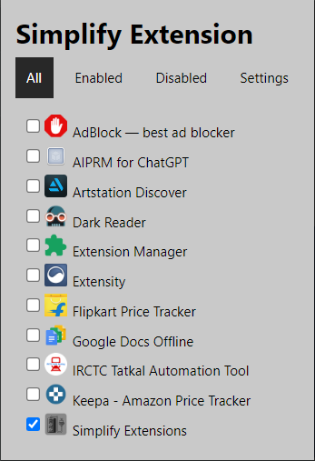

# simplifyExtensions
 "Simplify managing your Chrome extensions.",

 ## Development

Clone the repository, install the dependencies and start the application

```bash
git clone https://github.com/leelasaiprasanth/simplifyExtensions.git

```

Note: use the `depth` parameter to reduce the clone size and speed up the clone.

```sh
git clone --depth=1 https://github.com/leelasaiprasanth/simplifyExtensions.git
```

> Open chrome -> extensions ->  Manage Extensions -> Turn on Developer Mode -> Load unpacked -> Select simplifyExtensions (Folder)

## Under Development

- Extension Options Page


- Extenstion

